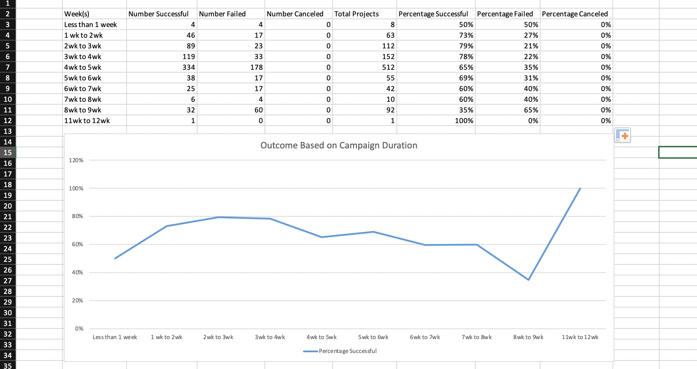

# Module_1_Challenge (Kickstarting with Excel)

## Overview of Project
Here we have Louise and she is a promising playwright. She recently wrote a play called Fever and she can't wait to put it on the stage. As of now, her budget is about $10,000 but she has no money to fund it. So she has come to me to ask for help so she can figure out how to proceed with her very first fundraising campaign.  

As an Excel expert with crowdfunding data in hand, I will be analyzing the data to see what makes a campaign successful one. And based on the analysis, I will be able to help Louis decide when she should start the campaign as well as how much she should set her budget to be.

## Analysis of Outcomes Based on Launch Date

The month that launched the most amount of successful fundraising campaigns for theater was May. On the other hand, May was also the month that had the most amount of failed cases as well although June, July, August, and October all had virtually the same number of failed campaigns launched. However, the amount of successful campaigns for June, July, August, and October is all lower compared to May.

## Challenges Encountered during this Analysis
It wasn't intuitive for me that I would have to create new columns like _Parent Category_ and _Subcategory_. I think I would have just created a pivot table based on _Category and Subcategory_ if I wasn't instructed to do otherwise. However, it makes sense now why it's important to create a new column based on data in another column since there are several subcategories such as _plays_, _spaces_, and _musicals_ under _theater_. As a result of doing so, I would be able to narrow down the analysis and give more reliable advice to Louise in case she's interested in knowing the result for plays only. 

## Analysis of Outcomes Based on Goals

The campaigns are most likely to succeed in reaching the goal when the goal for fundraising is less than $1,000. And the percentage for success gradually goes down and it hits the lowest at the _25,000 to 29,999_ range. However, it goes up again, peaks at 67% success percentage at _35,000 to 39,999 and 40,000 to 44,999_, and hits the all time low (0%) at _45,000 to 49,999_. One thing to note at the __40,000 to 44,999__ range is that it has the biggest discrepancy of 100% between the successful and failed percentage.

## Challenges Encountered during this Analysis
I had a hard time figuring out the syntax for the function **COUNTIFS**. Especially, it took me awhile to learn that I would have to write the range separately when the range is something like __1,000 to 4,999__. 
After figuring that out, it was just changing the numbers for each cell but populating each cell manually was a little tedious and I thought it would be really helpful if there is a way to automate the populating process. Becoming an excel expert is still work in progress.

## Results

- What are two conclusions you can draw about the Outcomes based on Launch Date?

It's tempting to suggest Louise that she should start her fundraising campaign in May since that's when we see the highest number for successful campaign being launched. However, since there is a gradual downhill in those numbers post May, it may be best to advise Louise that she start to get the campaign going some time in either late March or early April so that she can be in the prime position to get funded well in May. 

I would also suggest Louise that she consider not starting the campaign during the winter season. It is strange since you would think people would want to spend time doing indoor activities in the cold weather but the numbers indicate quite the opposite. So it'd be best if Louise could stay away from launching campaigns from October to February.

- What can you conclude about the Outcomes based on Goals?

Given that her budget is about $10,000, advising her to lower her budget down to $1,000 is probably not the best advice even though that's where we see the highest success percentage of the budget goals being achieved. If we look at right where her budget is, we see that there is 54% chance to achieve the $10,000 goal. Compared to 46% chance to fail at the same range, it's slightly hopeful but there's still room for Louis to not reach her goal.

So basically she has two options to choose from. She can either proceed with the current budget and expect to not raise enough money or consider cutting down some costs in her budget and choose to take the safer route.

- What are some limitations of this dataset?

I think the dataset could have been more detailed geographically to get Louise more relevant analysis for her campaign. For example, if there was a header for states and counties instead of just US, I think Louise would have been able to strategize and determine where she should launch her fundraising campaign. 

Let's take Hardin County, Illinois vs. Cook County, Illinois as an example. According to the population data from the 2020 Census Redistricing dataset, Hardin County is a small rural county in Illinois where there's only about population of 3,649 people. On the other hand, Cook County is a big urban county with about population of 5,275,541 people. With such a huge discrepancy in population, it's evident that the number of infrastructures for entertainment such as theaters would also be glaringly different between the counties and obviously Cook County should be the better county to launch her campaign.

But nowadays, people use online fundraising platforms like GoFundMe so you may argue the campaign was held online and having country as a header is sufficient. However, that's also another missing key information that was not part of this dataset. That is, how were all these campaigns performed? Online? Offline? Or mix of both? It would have been very helpful if such data was included so we could have another layer of factor to do analysis and give advice for Louise to take.

- What are some other possible tables and/or graphs that we could create?
I think we could create another column for __duration of the campaign__ so we can analyze the relationship between the duration and the outcomes. So I did some research on how to find the difference between two dates and did the analysis.
