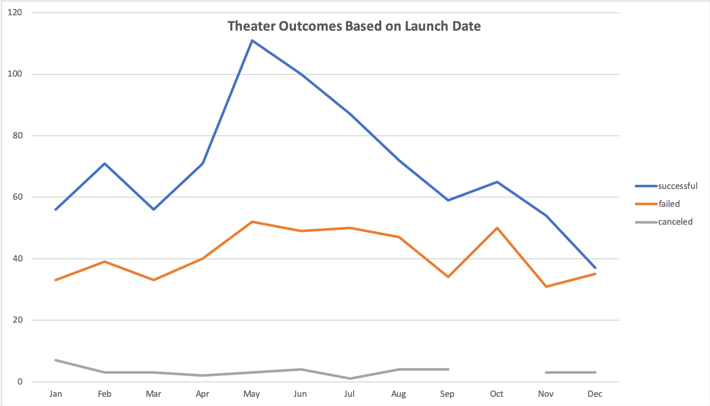
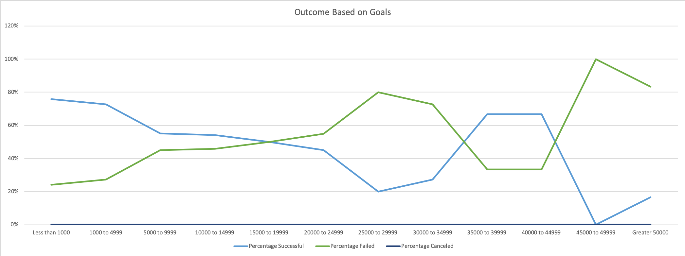

# Module_1_Challenge (Kickstarting with Excel)

## Overview of Project
Here we have Louise and she is a promising playwright. She recently wrote a play called Fever and she can't wait to put it on the stage. As of now, her budget is about $10,000 but she has no money to fund it. So she has come to me to ask for help so she can figure out how to proceed with her very first fundraising campaign.  

As an Excel expert with crowdfunding data in hand, I will be analyzing the data to see what makes a campaign successful one. And based on the analysis, I will be able to help Louis decide when she should start the campaign as well as how much she should set her budget to be.

## Analysis of Outcomes Based on Launch Date

The month that launched the most amount of successful fundraising campaigns for theater was May. On the other hand, May was also the month that had the most amount of failed cases as well although June, July, August, and October all had virtually the same number of failed campaigns launched.

## Challenges Encountered during this Analysis
It wasn't intuitive for me that I would have to create new columns like _Parent Category_ and _Subcategory_. I think I would have just created a pivot table based on _Category and Subcategory_ if I wasn't instructed to do otherwise. However, it makes sense now why it's important to create a new column based on data in another column since there are severeal subcategories such as _plays_, _spaces_, and _musicals_ under _theater_. As a result of doing so, I would be able to narrow down the analysis and give more reliable advice to Louise in case she's interested in knowing the result for plays only. 

## Analysis of Outcomes Based on Goals

The campaigns are most likely to succeed in reaching the goal when the goal for fundraising is less than $1,000. 

### Challenges and Difficulties Encountered

## Results

- What are two conclusions you can draw about the Outcomes based on Launch Date?

- What can you conclude about the Outcomes based on Goals?

- What are some limitations of this dataset?

- What are some other possible tables and/or graphs that we could create?
